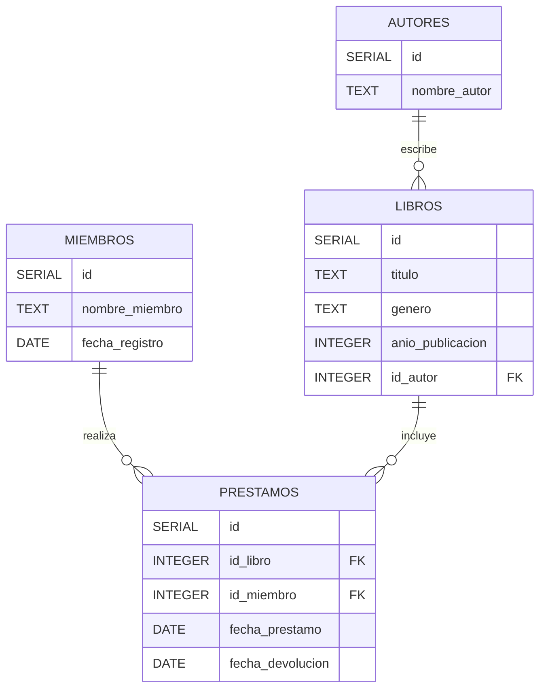

## Objetivos del Ejercicio

1. **Crear una base de datos y sus tablas relacionadas.**
2. **Insertar registros en las tablas.**
3. **Realizar consultas simples y complejas usando `INNER JOIN` y `UNION`.**
4. **Aplicar funciones agregadas como `MAX`, `MIN`, `SUM`, `AVG`.**
5. **Entender cómo funcionan las claves primarias y foráneas.**

---


## 0. Diagrama ER con Mermaid



## 1. Creación de la Base de Datos y Tablas

### Script de Creación de la Base de Datos

```sql
CREATE DATABASE biblioteca;

\c biblioteca;

CREATE TABLE Autores (
    id SERIAL PRIMARY KEY,
    nombre_autor TEXT NOT NULL
);

CREATE TABLE Libros (
    id SERIAL PRIMARY KEY,
    titulo TEXT NOT NULL,
    genero TEXT NOT NULL,
    anio_publicacion INTEGER NOT NULL,
    id_autor INTEGER REFERENCES Autores(id)
);

CREATE TABLE Miembros (
    id SERIAL PRIMARY KEY,
    nombre_miembro TEXT NOT NULL,
    fecha_registro DATE DEFAULT CURRENT_DATE
);

CREATE TABLE Prestamos (
    id SERIAL PRIMARY KEY,
    id_libro INTEGER REFERENCES Libros(id),
    id_miembro INTEGER REFERENCES Miembros(id),
    fecha_prestamo DATE DEFAULT CURRENT_DATE,
    fecha_devolucion DATE
);
```

---

## 2. Inserción de Registros

### Autores

```sql
INSERT INTO Autores (nombre_autor) VALUES 
('Gabriela Mistral'),
('Pablo Neruda'),
('Roberto Bolaño'),
('Isabel Allende');
```

### Libros

```sql
INSERT INTO Libros (titulo, genero, anio_publicacion, id_autor) VALUES 
('Desolación', 'Poesía', 1922, 1),
('Cien sonetos de amor', 'Poesía', 1959, 2),
('2666', 'Literatura Contemporánea', 2004, 3),
('La casa de los espíritus', 'Literatura Contemporánea', 1982, 4),
('Confieso que he vivido', 'Autobiografía', 1974, 2);
```

### Miembros

```sql
INSERT INTO Miembros (nombre_miembro) VALUES 
('Carlos Díaz'),
('María González'),
('Pedro López'),
('Ana María Rodríguez');
```

### Préstamos

```sql
INSERT INTO Prestamos (id_libro, id_miembro, fecha_prestamo, fecha_devolucion) VALUES 
(1, 1, '2024-08-01', NULL),
(3, 2, '2024-08-03', '2024-08-10'),
(4, 3, '2024-08-04', NULL),
(2, 4, '2024-08-05', '2024-08-12');
```

---

## 3. Consultas SQL

### **Consultas Básicas**

#### **Seleccionar todos los autores:**

```sql
SELECT * FROM Autores;
```

#### **Seleccionar todos los libros de poesía:**

```sql
SELECT * FROM Libros WHERE genero = 'Poesía';
```

### **Consultas con `INNER JOIN`**

#### **Mostrar los libros junto con los nombres de sus autores:**

```sql
SELECT Libros.titulo, Autores.nombre_autor 
FROM Libros
INNER JOIN Autores ON Libros.id_autor = Autores.id;
```

### **Consulta con `UNION`**

```sql
SELECT 
    titulo AS descripcion, 
    anio_publicacion AS fecha, 
    'Libro' AS tipo
FROM 
    Libros

UNION

SELECT 
    nombre_miembro AS descripcion, 
    DATE('now') AS fecha, 
    'Miembro' AS tipo
FROM 
    Miembros;
```

### **Consultas con Funciones Agregadas**

#### **Máximo y Mínimo Año de Publicación de Libros:**

```sql
SELECT 
    MAX(anio_publicacion) AS anio_publicacion_mas_reciente, 
    MIN(anio_publicacion) AS anio_publicacion_mas_antiguo
FROM 
    Libros;
```

#### **Cantidad Total de Libros por Género:**

```sql
SELECT 
    genero, 
    COUNT(*) AS cantidad_libros
FROM 
    Libros
GROUP BY 
    genero;
```

#### **Promedio de Libros Prestados por Miembro:**

```sql
SELECT 
    id_miembro, 
    AVG(cantidad_prestamos) AS promedio_prestamos
FROM 
    (SELECT 
        id_miembro, 
        COUNT(*) AS cantidad_prestamos
    FROM 
        Prestamos
    GROUP BY 
        id_miembro) AS subconsulta
GROUP BY 
    id_miembro;
```

#### **Suma Total de Años desde las Publicaciones de Libros:**

```sql
SELECT 
    SUM(EXTRACT(YEAR FROM AGE(DATE 'now', DATE '01-01-' || anio_publicacion::text))) AS suma_anios
FROM 
    Libros;
```

---

## 4. Tipos de Datos en PostgreSQL

- **`SERIAL`**: Un tipo de dato que crea un campo entero auto-incremental.
- **`INTEGER`**: Almacena números enteros.
- **`CHAR(n)`**: Almacena cadenas de texto de longitud fija.
- **`VARCHAR(n)`**: Almacena cadenas de texto de longitud variable.
- **`TEXT`**: Almacena cadenas de texto de longitud ilimitada.
- **`DATE`**: Almacena fechas (año, mes, día).
